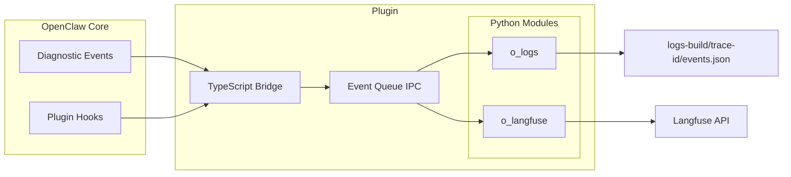

## Architecture Overview

The plugin will use a hybrid TypeScript/Python architecture:

- **TypeScript bridge** (`index.ts`): Registers with openclaw's plugin system to intercept diagnostic events
- **Python modules**: Handle the actual logging and Langfuse integration



### Output Formats

- **IPC stream** (`events.jsonl`): JSONL format (one JSON object per line) for efficient streaming between TypeScript and Python
- **Log files** (`logs-build/<trace-id>/events.json`): Pretty-printed JSON arrays for human readability

## Configuration

### Plugin Manifest (`openclaw.plugin.json`)

The `openclaw.plugin.json` file serves as the **manifest** for the plugin. It tells OpenClaw how to identify, load, and validate the plugin.

- **`id`**: The unique identifier for the plugin (e.g., `o-observability`). This ID is used in the `openclaw.json` configuration file to enable/disable the plugin.
- **`configSchema`**: A JSON Schema object that defines the valid configuration structure for the plugin. OpenClaw uses this schema to:
    1.  Validate the user's configuration in `openclaw.json` before loading the plugin.
    2.  Provide type safety and error reporting if the user provides invalid settings.

Example `openclaw.plugin.json`:
```json
{
  "id": "o-observability",
  "configSchema": {
    "type": "object",
    "additionalProperties": false,
    "properties": {}
  }
}
```

### Langfuse Integration Setup

To enable Langfuse tracing, you need to configure your API keys in the `.env` file at the **openclaw root directory** (not in the plugin folder).

1. Copy the Langfuse configuration from `.env.example` to `.env`:

```bash
# Langfuse API keys for tracing visualization
LANGFUSE_SECRET_KEY=sk-lf-your-secret-key-here
LANGFUSE_PUBLIC_KEY=pk-lf-your-public-key-here
LANGFUSE_BASE_URL=https://cloud.langfuse.com
```

2. Replace the placeholder values with your actual Langfuse API keys from [cloud.langfuse.com](https://cloud.langfuse.com)

3. Restart the Docker gateway to apply the changes

Without these credentials, the plugin will log events to local files but will not send traces to Langfuse.
